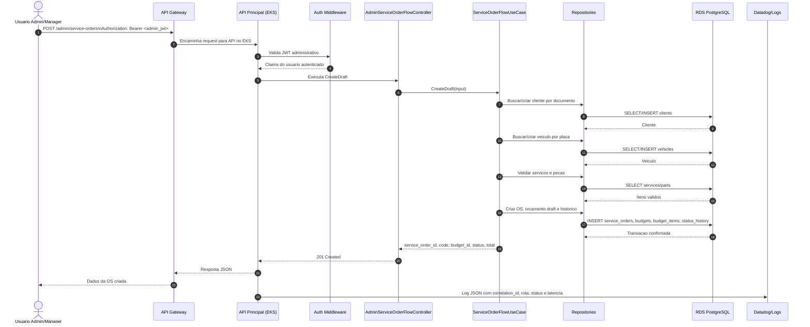

# Sequencia: Abertura De Ordem De Servico

Este diagrama descreve o fluxo principal de abertura de ordem de servico pela area administrativa.
O cliente usa o CPF/CNPJ no cadastro da OS, mas a autenticacao administrativa continua por JWT de usuario interno.



## Regras Do Fluxo

- A rota exige JWT administrativo com role `ADMIN` ou `MANAGER`.
- O documento do cliente e validado pela aplicacao principal durante a abertura da OS.
- A criacao da OS, do orcamento inicial e do historico deve ocorrer de forma transacional.
- Se algum servico ou peca nao existir, a API responde `400`.
- Se houver conflito de dados, a API responde `409`.
- Toda resposta de erro deve incluir `correlation_id` quando a request passa pelo middleware de observabilidade.

## Endpoint

```text
POST /admin/service-orders
```

## Repositorios Envolvidos

- `tech-challenge-project`: regra de negocio e endpoint HTTP.
- `tech-challenge-infra-k8s`: API Gateway, EKS e manifests da API.
- `tech-challenge-infra-database`: RDS PostgreSQL e modelagem.

